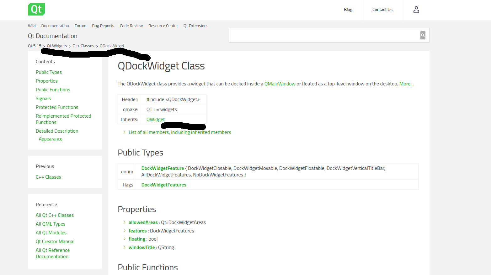

# Fixing up * Imports

If you have gone through most plugin source files and example scripts found online, you find there's alot * imports. [PEP8](https://www.python.org/dev/peps/pep-0008/#imports) discourages this and can prove to be a
pain when refactoring code. It's difficult to know which modules have been used in that name space of from which module does a given method used in the code is imported from.

> Wildcard imports (from *module* import*) should be avoided, as they make it unclear which names are present in the namespace, confusing both readers and many automated tools. There is one defensible use case for a wildcard import, which is to republish an internal interface as part of a public API (for example, overwriting a pure Python implementation of an interface with the definitions from an optional accelerator module and exactly which definitions will be overwritten isn't known in advance).
>
> Imports are always put at the top of the file, just after any module comments and docstrings, and before module globals and constants.
> Imports should be grouped in the following order:
>
> - Standard library imports.
> - Related third party imports.
> - Local application/library specific imports.
>
> You should put a blank line between each group of imports.

Linting tools like ```pylint``` and ```autopep8``` also does not work well with star imports.
In general avoiding * imports improve the code readablity and maintainability by other devs who might be new to that domain.

```python
from PyQt4.QtGui import *
```

versus

```python
from qgis.PyQt.QtWidgets import QDialog
```

Which clearly indicates which class or function in that module have been used

I found this part somewhat challenging since I already new that GUI items in Qt were moved from the QtGui to QtWidgets module, if you are just starting out, simply follow along with [opengis guideline](https://www.opengis.ch/2018/04/13/porting-qgis-plugins-to-api-v3-strategy-and-tools/)

If Python interpreter compolains about a given function call is not within the Module from which it was imported; this often happens with the PyQt5 api. Then a quick search of of the class function or method in the well documentation should provide an indication from which module shou it be imported. For example A quick search for ``QDockWidget`` in Qt5 docs. Understanding of Qt C++ docs is always a plus as you'll have an easy time navigating through the modules and class hierachy. For instance



The top part indicates  ``Qt 5.15 > QtWidgets > C++ Classes > QDockWidget`` which in turn in PyQt5 implies that QDockWidget is found in the QtWidgets module, inherits QWidgets properties, and the corresponding import in your plugin should be ```from qgis.PyQt.QtWidgets import QDockWidget``` the page also contains info about the properties, types and functons.

You  can use the same approach to understand the QGIS C++ api and class hierachy.

One more edit before proceeding to the next section:
In  ```metadata.txt``` found in the root of your plugin folder change ```qgisMinimumVersion=3.0```. This work through assumes that this port does not cater for backward compatibility within this branch and we'll only be support QGIS3.x versions.
