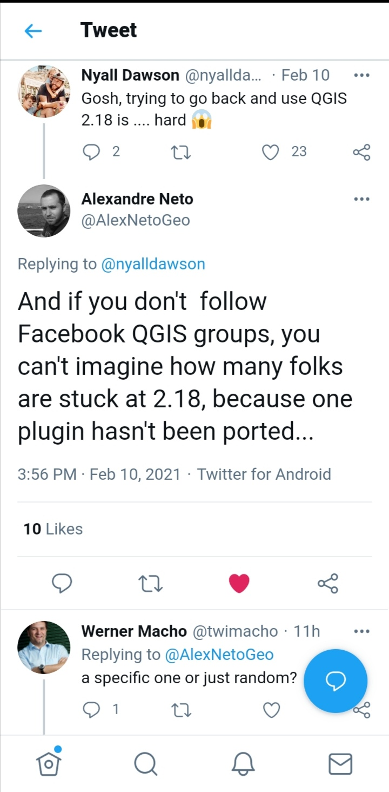

# Introduction

Why would one be interested in porting an old QGIS2 plugin to QGIS3? Spin up a new plugin? Use the improved processing framework models for that given workflow?

on a lighter note, you'd be surprised!!


Before beginning such a journey the need to do so must have risen either from a client's request, or the functionality provided by such a plugin is still not available natively in qgis3 core or core plugins. Maybe the plugin was used to access a private rest API service. Or the individual developer of such plugin haven't updated yet. All the reasons one might site, would trigger the urge to migrate the plugin by themselves. **QGIS3 comes with a tone of fuctionalities provided by default, as opposed to having to install some plugins back in v2; please check first if what you're seeking to achieve available**

From personal experience, I have encountered some organizations still using qgis2.18 because of a custom plugin that was developed for them to suit their daily workflow and is only compatible with v2 API. For instance the [Surveying Calculation plugin](https://github.com/zsiki/ls) that was developed by DigiKom and Zanzibar local authorities was developed for v2 to aid in survey and traverse/triangulation network calculation, adjustments, and reductions. It has seen less or rather in active development and is not supported by v3 API or the [OpenAerialMap Plugin](https://github.com/hotosm/oam-qgis-plugin) by HOTOSM to access and upload imagery from the open Aerial map platform, unfortunately the development was halted and is not maintained at the moment [try this repo](https://github.com/yojiyojiyoji/oam_qgis3_express).

such plugins could have been part of your daily workflow pipelines as an individual or an org as a whole. So would you rather stick to legacy QGIS version or upgrade to feature-rich and improved user experience v3 offers. With plugins, one could play around with some of the semi-automated tools to port your plugin of choice if it is no longer/does not support QGIS3.

Since the release of QGIS v3, the community has tried to come with guides to help plugin developers to port their code to this version and a few best practices.

QGIS itself is written in  ```C++```, ```Qt framework``` and ```Python``` as the main scripting language. There's been myriads of changes within the  ```QT Framework```  official deprecation of  ``Qt4`` to ``Qt5``  and   ```python2``` *End of life* and  support early 2020 to ```python3``` which is the programming language used to develop plugins and custom scripts in QGIS.

Qt company recently announced the release of ```Qt6``` as well as ```PySide6(Qt for python)``` good news to python developers as Qt officially now supports the language, beside develpement of tools like ```shiboken``` to bring your C++ code to python side. Well  what does this mean  to QGIS users?
Your guess is as good as mine. In the near future there'll be an upgrade to this new api probably in QGIS  v4. This would emphasize more on why one might need to update to v3 api since the next migration guide would probably be specific to porting from QGIS3 to QGIS4.

Some of the significant changes in Qt4 to Qt5 are in the QtGui module which used to host the graphical widgets that was moved to the QtWidgets module. i.e in the v4 API.

```python
from PyQt4.QtGui import (QDialog, QTabWidget, QWidget, QLayout)
```  

to:

```python  
from PyQt5.QtWidgets import (QDialog, QTabWidget, QWidget, QLayout)
```  

or Using version independent api provided by qgis modules

```python  
from qgis.PyQt.QtWidgets import (QDialog, QTabWidget, QWidget, QLayout)
```  

## Typical Migration workflow/steps

1. Unit tests
2. Fixing *(star) imports
3. Versioning strategy/ legacy code back up.
4. Install the code porting helpers
5. Porting ```Python2 to 3``` and ```PyQt4 to PyQt5```
6. Finding/Checking for API v2 usage in the plugin  code base

## Useful links

- [Plugin Migration to QGIS3 wiki](https://github.com/qgis/QGIS/wiki/Plugin-migration-to-QGIS-3)
- [qgis2to3 tool](https://github.com/opengisch/qgis2to3) also includes ```python2to3``` api tools
- [qgis2apifinder](https://github.com/opengisch/qgis2to3/tree/master/qgis2to3/api2finder)
- [qgis api compatibility](https://qgis.org/api/api_break.html) Highlights api breaks and backward compatibility between the two versions.
- [opengis.ch porting guideline](https://www.opengis.ch/2018/04/13/porting-qgis-plugins-to-api-v3-strategy-and-tools/) which this guide is based on, Published by Marco Bernasocchi on 2018-04-13.
- [First Aid Plugin](https://www.lutraconsulting.co.uk/blog/2016/06/12/introducing-first-aid-plugin/) [repo](https://github.com/wonder-sk/qgis-first-aid-plugin) Helps in debugging the plugin, points out the exact line an error has occured.
- [plugin Reloader](https://github.com/borysiasty/plugin_reloader) More like a "hot reload" tool once you make any changes to your plugin code without have to relaunch qgis instance.
